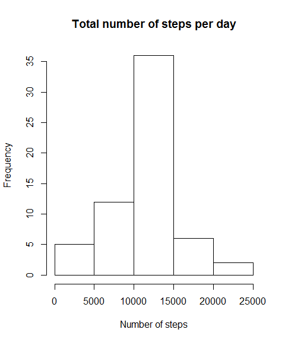

### 1. Code for reading in the dataset and/or processing the data

First the working directory is set, then the data is downloaded and
loaded and finally the necessary libraries are loaded. After the data is
loaded, the data is saved in a variable and the necessary
transformations are carried out.

    setwd("C:/Users/helbouazzaoui/Desktop/Coursera course/Data science course/Course 5 Reproducible Research/Week 2")

    fileurl <- "https://d396qusza40orc.cloudfront.net/repdata%2Fdata%2Factivity.zip"

    if(!file.exists("./data")){dir.create("./data")}
    download.file(fileurl, destfile = "./data/exdata_data_NEI_data.zip", method = "curl")

    unzip("./data/exdata_data_NEI_data.zip", overwrite = T, unzip = "internal")

    act_data <- read.csv("activity.csv", sep=",",na.strings="NA")

    act_data$date <- as.Date(act_data$date, format = '%Y-%m-%d')

    library(data.table)
    library(ggplot2)

### 2. Histogram of the total number of steps taken each day

A histogram of the total number of steps taken each day is created using
the loaded data.

    tmp <- data.table(act_data)
    total_steps_perday <- tmp[, list(steps = sum(steps)), by = c("date")]

    hist(total_steps_perday$steps,
         main = "Total number of steps per day",
         xlab = "Number of steps", 
         ylab = "Frequency"
         )

### 3. Mean and median number of steps taken each day

The mean and median are calculated using the total steps taken per day.
The NA values are removed when calculating the mean and median.

    median(total_steps_perday$steps, na.rm = TRUE)

    ## [1] 10765

    mean(total_steps_perday$steps, na.rm = TRUE)

    ## [1] 10766.19

### 4. Time series plot of the average number of steps taken

First the average number of steps taken for each interval is calculated.
This is done by using the data.table package and calculated the the mean
steps for each interval across al days.

    tmp_int <- data.table(act_data)
    tmp_int$steps[is.na(tmp_int$steps)] <- 0
    average_steps_perinterval <- tmp_int[, list(steps = mean(steps)), by = c("interval")]

Using the average number of steps per internval, a time series plot is
created

    plot(average_steps_perinterval$interval, average_steps_perinterval$steps, type = "l",
         main = "AVerage number of steps taken per time interval",
         xlab = "5 minute time interval", 
         ylab = "Average number of steps")

### 5. The 5-minute interval that, on average, contains the maximum number of steps

First find the index of the maximum number of steps.

    max_steps <- which(average_steps_perinterval$steps == max(average_steps_perinterval$steps))

Then find the interval that belongs to this index.

    average_steps_perinterval$interval[max_steps]

    ## [1] 835

Count the number of missing values

    sum(is.na(act_data$steps))

    ## [1] 2304

### 6. Code to describe and show a strategy for imputing missing data

First create a new temporary data set, where the whole data set is
reloaded

    tmp_data <- act_data
    tmp_data$steps[is.na(tmp_data$steps)] <- 0

Then the mean for each interval is recalculated and used to fill up the
missing values

    mean_steps_perinterval <- aggregate(steps~interval, tmp_data,mean)

A new dataset is then created where the missing NA values are filled in
with the calculated mean per day

    tmp_actdata <- merge(act_data, mean_steps_perinterval, by = 'interval', suffixes = c("","_mean_per_interval"))
    index_na <- which(is.na(tmp_actdata$steps))
    tmp_actdata$steps[index_na] <- tmp_actdata$steps_mean_per_interval[index_na]

A new dataset is create whitout missing values

    total_data <- tmp_actdata[,1:3]

### 7. Histogram of the total number of steps taken each day after missing values are imputed

A subset of the data is created using the data.table package

    tmp_tot <- data.table(total_data)
    new_total_steps_perday <- tmp_tot[, list(steps = sum(steps)), by = c("date")]

A histogram of the total number of steps per day is created

    hist(new_total_steps_perday$steps,
         main = "Total number of steps per day",
         xlab = "Number of steps", 
         ylab = "Frequency"
    )

The new median and mean are calculated

    median(new_total_steps_perday$steps)

    ## [1] 10395

    mean(new_total_steps_perday$steps)

    ## [1] 10581.01

These new median and mean have a different value than the previous ones.
The impact of imputing data can therefore be considered large.

### 8. Panel plot comparing the average number of steps taken per 5-minute interval across weekdays and weekends

First the timezone is set

    Sys.setlocale("LC_TIME", "English") 

    ## [1] "English_United States.1252"

A new factor variable with two levels. This variable is joined into the
existing data variable

    total_data$day[weekdays(total_data$date) %in% c("Monday","Tuesday","Wednesday","Thursday","Friday")]<-"weekday"
    total_data$day[weekdays(total_data$date) %in% c("Saturday", "Sunday")]<-"weekend"

The data set of the 5 minute interval data averaged across the weekdays
and weekends is created for the plot using the data.table package

    tmp_total_data <- data.table(total_data)
    new_average_steps_perinterval <- tmp_total_data[, list(steps = mean(steps)), by = c("day","interval")]

A time series plot is created using the ggplot function, where the plots
for weekdays and weekend are shown on top of each other

    g <- ggplot(new_average_steps_perinterval, aes(interval, steps)) 
    g + geom_line(stat = "identity") +
      facet_wrap(~day, nrow = 2) +
      labs(x = "interval [min]") + 
      labs(y = "Number of steps") + 
      labs(title = "Average number of steps taken, averaged across all weekday days and weekend days" )

